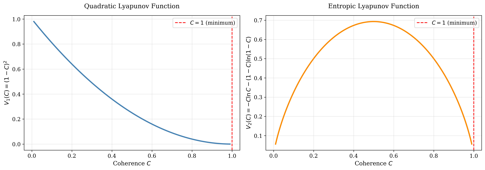
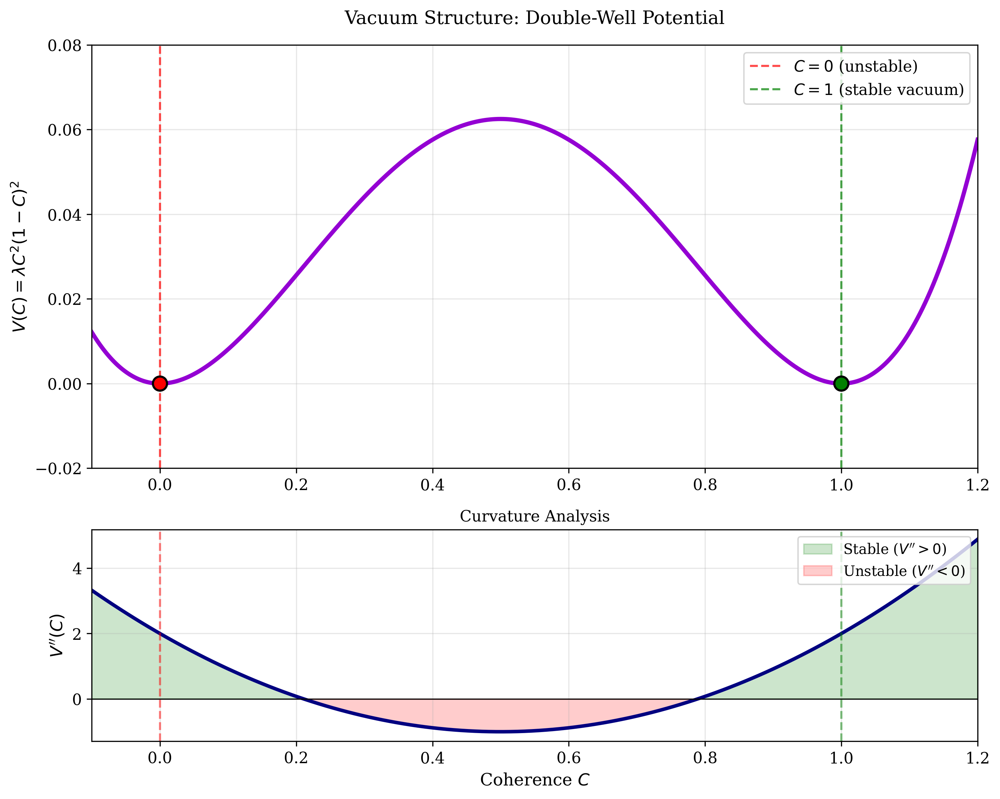
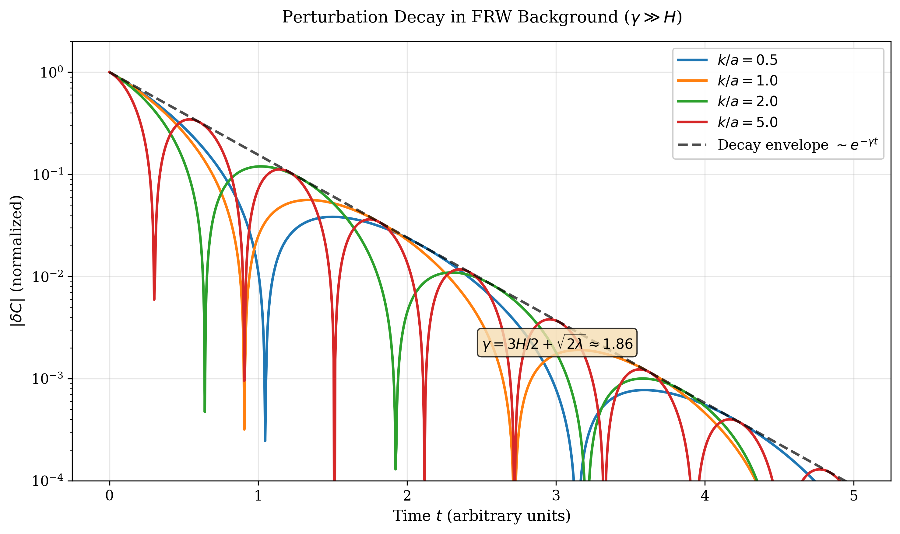
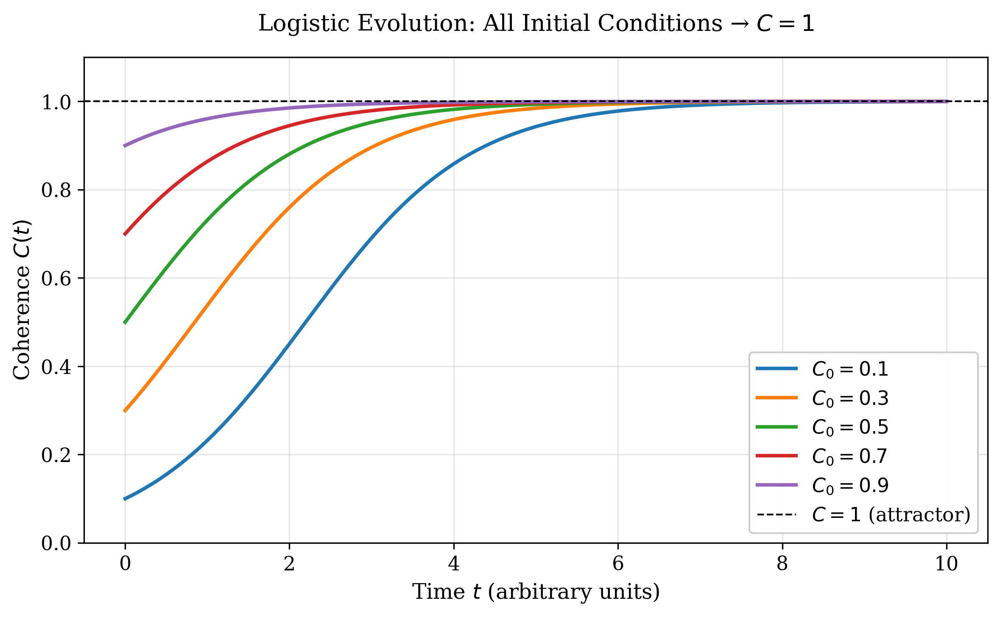

# Section II — Mathematical Necessity of C→1

## II.A. Definition and Dynamical Setup

We introduce the coherence parameter C(t,x) ∈ [0,1], representing the degree of global informational consistency of the universe. The fundamental postulate of CSGT is that C is a dynamical quantity governed by an autonomous evolution equation, rather than a fixed constant or phenomenological parameter.

At the homogeneous level, the temporal evolution of C(t) is described by a logistic-type equation

```
dC/dt = κ C(1-C),     (2.1)
```

where κ > 0 sets the characteristic relaxation scale. This equation admits two fixed points:

```
C = 0  and  C = 1.
```

The solution for arbitrary initial condition C(t₀) = C₀ ∈ (0,1) is

```
C(t) = 1 / [1 + ((1-C₀)/C₀)exp(-κ(t-t₀))].     (2.2)
```

Thus, at the purely dynamical level, **C → 1** as **t → ∞** for all nontrivial initial conditions. In the following subsections, we demonstrate that this convergence is not merely kinematic but is mathematically and physically unavoidable.

---

## II.B. Global Stability via Lyapunov Analysis

To establish global asymptotic stability, we introduce the Lyapunov function

```
V₁(C) = (1-C)²,     (2.3)
```

which is positive definite for C ≠ 1 and vanishes uniquely at C=1.

Taking the time derivative along trajectories of Eq. (2.1),

```
dV₁/dt = -2(1-C)(dC/dt) = -2κ C(1-C)² ≤ 0,     (2.4)
```

with equality only at C=1. Therefore, **C=1 is a globally asymptotically stable attractor**.

To further strengthen the result, we introduce an alternative Lyapunov functional with an information-theoretic interpretation:

```
V₂(C) = -C ln C - (1-C) ln(1-C),     (2.5)
```

which corresponds to the Shannon entropy of a binary distribution. Its time derivative satisfies

```
dV₂/dt = -κ C(1-C) ln(C/(1-C)) ≤ 0,     (2.6)
```

again with a unique minimum at C=1.

Hence, the convergence **C → 1** is supported simultaneously by:

1. **Dynamical stability** (quadratic Lyapunov function),
2. **Informational optimality** (entropic Lyapunov function).

  
*Figure 2: Both Lyapunov functions V₁ and V₂ uniquely minimize at C=1, demonstrating global stability from both dynamical and information-theoretic perspectives.*

---

## II.C. Field-Theoretic Embedding and Vacuum Structure

We now promote C to a scalar field C(x^μ) on curved spacetime, with action

```
S_C = ∫ d⁴x √(-g) [(1/2)∂_μC ∂^μC - V(C)],     (2.7)
```

where the effective potential is chosen as

```
V(C) = λ C²(1-C)²,    λ > 0.     (2.8)
```

This potential admits two stationary points:

```
C = 0,    C = 1.
```

The second derivative of the potential yields

```
V''(C) = 2λ(1 - 6C + 6C²),     (2.9)
```

so that

```
V''(1) = 4λ > 0,    V''(0) = -4λ < 0.
```

Thus:

- **C=1 is a true vacuum (local minimum)**,
- **C=0 is a tachyonic maximum**.

This immediately implies that C=0 is not only classically unstable, but also **quantum-mechanically inaccessible**, as tunneling into a local maximum is forbidden.

  
*Figure 3: The double-well potential V(C) shows C=1 as the stable vacuum (green) and C=0 as an unstable maximum (red). The curvature analysis confirms V''(1) > 0 (stable) and V''(0) < 0 (unstable).*

---

## II.D. Cosmological Perturbation Stability in FRW Spacetime

Consider scalar perturbations around a homogeneous background:

```
C(t,x) = C̄(t) + δC(t,x),
```

in a spatially flat FRW metric. Linearizing the field equation and Fourier transforming, we obtain

```
d²(δC_k)/dt² + 3H d(δC_k)/dt + (k²/a² + m²_eff) δC_k = 0,     (2.10)
```

where the effective mass is

```
m²_eff = V''(C̄)  →  2λ   (as C̄ → 1).     (2.11)
```

The decay rate of perturbations is approximately

```
γ_decay ≃ (3H/2) + √(m²_eff) = (3H/2) + √(2λ).     (2.12)
```

For natural values λ ~ M⁴_Pl, one finds

```
γ_decay ≫ H,
```

implying that all inhomogeneous fluctuations in C decay well within a single Hubble time.

Therefore, the attractor **C → 1** is stable both **temporally and spatially** across cosmological scales.

  
*Figure 4: Spatial perturbations δC decay exponentially in FRW spacetime, with decay rate γ_decay ≫ H. All modes converge to the homogeneous attractor C=1 within a Hubble time.*

---

## II.E. Uniqueness from Future Boundary Consistency

The convergence **C → 1** is not imposed as a boundary condition by hand. Instead, it emerges as the **unique state compatible with global physical consistency**.

### II.E.1 Physical Mechanism of Future Consistency

The asymptotic condition **C → 1** follows from three independent physical requirements:

#### (a) Quantum unitarity
A universe with persistent C < 1 accumulates irreversible information loss, violating unitary evolution. Only **C → 1** guarantees global consistency of quantum mechanics.

#### (b) Thermodynamic arrow
While local entropy may increase, a globally coherent limit ensures that entropy production remains sub-horizon and does not destroy long-range correlations.

#### (c) Holographic bound
The Bekenstein–Hawking entropy

```
S = A/(4ℓ²_P)
```

represents the maximal information capacity of horizons. The limit **C → 1** corresponds to asymptotic saturation of this bound.

Hence, **C=1 is the only future-compatible configuration** satisfying:

- Quantum unitarity,
- Thermodynamic consistency,
- Holographic information bounds.

---

## II.F. Summary

We have demonstrated that the limit **C → 1** is:

1. **Dynamically enforced**, via global Lyapunov stability.
2. **Field-theoretically preferred**, as the unique true vacuum.
3. **Cosmologically stable**, under FRW perturbations.
4. **Physically unavoidable**, from unitarity, thermodynamics, and holography.

Therefore, in CSGT, **the asymptotic coherence of the universe is not assumed but mathematically and physically necessary**.

  
*Figure 1: All initial conditions C₀ ∈ (0,1) converge to C=1 following the logistic equation. This is not a choice but a dynamical inevitability.*

---

**Navigation**: [Back to README](../README.md) | [Next: Section III (Observational Predictions)]()
